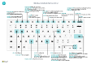

# Referencia rápida de teclado: solo PCKeyboard Quick Reference - PC Only

||||  
|----------------|-----------|----------------|
|**General****General**|Alt+F2Alt+F2 Alt+NAlt+N Alt+Mayús+NAlt+Shift+N Alt+OAlt+O Alt+QAlt+Q Alt+ArribaAlt+Up Alt+flecha abajoAlt+Down Arrow Alt+TAlt+T Alt+Mayús+WAlt+Shift+W Ctrl+InsertarCtrl+Insert Ctrl+SuprCtrl-Delete Ctrl+Shift+F12Ctrl+Shift+F12 Ctrl+F1Ctrl+F1 Ctrl+ClicCtrl+Click Shift+F12Shift+F12 F5/Ctrl+F5F5/Ctrl+F5 Tab/Mayús+TabTab/Shift+Tab |Mostrar u ocultar el panel de cuadro informativoShow and hide the FactBox pane Crear un registro nuevoCreate a new record Cerrar un registro recién creado y crear uno nuevoClose a newly created record and create a new one Agregar una nueva nota para el registro seleccionadoAdd a new note for the selected record Abrir **Dígame**Open **Tell me** Abrir la información sobre herramientas o el error de validaciónOpen tooltip or validation error Abrir un menú desplegable o buscarOpen a drop-down or look up Abrir la página **Mi configuración**Open the **My Settings** page Abrir la ficha o documento actual en una nueva ventanaOpen the current card or document in a new window Insertar una nueva línea en un documentoInsert a new line on a document Eliminar la línea de un documento, diario u hoja de trabajoDelete the line on a document, journal, or worksheet Maximizar la parte de productos de línea en una página de documentoMaximize the line items part on a document page Abrir la ayuda de la páginaOpen help for the page Navegar al personalizarNavigate when personalizing and customizing Abrir el explorador de roles, una descripción general de la funciónOpen the role explorer, a feature overview Actualizar o volver a cargar la páginaRefresh/reload page Desplazar el enfoque al elemento siguiente/anteriorMove focus to the next/previous element|
|**Desplazarse y  seleccionar filas****Navigate & select rows**| Inicio/FinHome/End Ctrl+Inicio/FinCtrl+Home/End  Ctrl+Flecha arriba/abajoCtrl+Up/Down Ctrl+ECtrl+A  Ctrl+EspacioCtrl+Space Ctrl/Shift+ClicCtrl/Shift+Click Mayús+Flecha arriba/abajoShift+Up/Down Mayús+Av/Re PágShift+Page Up/Down Ctrl+EnterCtrl+Enter| Ir al primer/último campoGo to first/last field Ir a la primera/última filaGo to first/last row Desplazarse sin perder la selecciónNavigate without losing selection Seleccionar todoSelect all Alternar la selección de la filaToggle row selection  Agregar la fila o las filas a la selecciónAdd the row/rows to the selection Agregue una fila arriba/debajo de la selecciónAdd row above/below to selection Seleccionar filas visibles arriba/abajoSelect visible rows above/below  Centrarse en la listaFocus out of the list|
|**Copiar y pegar****Copy & paste**|Ctrl+C/VCtrl+C/V F8F8|Copiar/pegar filasCopy/paste rows Copiar campo de arriba a la fila actualCopy field above into current row|
|**Buscar, filtrar  y ordenar****Search, filter,  & sort**|F6F6 Alt+F7Alt+F7 F3F3 Shift+F3Shift+F3 Ctrl+Shift+F3Ctrl+Shift+F3 Alt+F3Alt+F3 Mayús+Alt+F3Shift+Alt+F3 Ctrl+Alt+Mayús+F3Ctrl+Alt+Shift+F3|Desplazarse a la siguiente ficha desplegableMove to next FastTab Clasificar la columna en orden ascendente/descendenteSort column in ascending/descending order Búsqueda alternativaToggle search Alternar el panel de filtros; centrarse en los filtros de campoToggle filter pane; focus on field filters Alternar el panel de filtros; centrarse en los filtros de totalesToggle filter pane; focus on totals filters Filtrar en el valor de la celda seleccionadaFilter on selected cell value Agregar un filtro en el campo seleccionadoAdd filter on selected field Restablecer filtrosReset filters|
|**Entrada rápida****Quick entry**|Ctrl+Mayús+EntrarCtrl+Shift+Enter Entrar/Mayús+EntrarEnter/Shift+Enter|Ir al siguiente campo de entrada rápida fuera de una listaGo to next Quick Entry field outside a list Ir al campo de entrada rápida siguiente/anteriorGo to next/previous Quick Entry field|
|**Vista preliminar de un informe****Report preview**|Ctrl+Inicio/FinCtrl+Home/End|Ir a la primera/última páginaGo to the first/last page|

> [!TIP]
> Para obtener una versión gráfica y preparada para imprimir elija la siguiente imagen y descargue el archivo PDF.For a graphical, print-friendly version, choose the following image and download the PDF file.
>
> 
