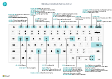

# Accesos directos de tecladoKeyboard Shortcuts
Este producto proporciona un resumen de algunas de las combinaciones de métodos abreviados que se pueden utilizar cuando trabaje con [!INCLUDE[prodshort](includes/prodshort.md)].This article provides an overview of some of the shortcut key combinations that you can use when you are working with [!INCLUDE[prodshort](includes/prodshort.md)].

Para obtener una descripción general de los métodos abreviados de teclado más populares, vea [Métodos abreviados de teclado (solo PC)](keyboard-shortcuts-cheatsheet.md).For an overview of the most popular keyboard shortcuts, see [Keyboard Shortcuts (PC only)](keyboard-shortcuts-cheatsheet.md).

> [!TIP]
> Para obtener una vista gráfica de los métodos abreviados más utilizados, elija la siguiente imagen y descargue el archivo PDF.For a graphical view of the most used shortcuts, choose the following image and download the PDF file.
>
> 

## PanoramaOverview
Los métodos abreviados de teclado ayudan a la accesibilidad y pueden hacer que sea más fácil y más eficiente navegar por diferentes áreas y elementos en una página.Keyboard shortcuts aid accessibility and can make it easier and more efficient to navigate to different areas and elements on a page. Son compatibles con la mayoría de los exploradores web; sin embargo el comportamiento puede variar ligeramente.They are supported by most web browsers, however, the behavior may vary slightly.

> [!NOTE]
> Los métodos abreviados de teclado aquí descritos se refieren al diseño del teclado de EE. UU.The keyboard shortcuts described here refer to the U.S. keyboard layout. Puede que la distribución de las teclas de otros teclados no se corresponda exactamente con las teclas de un teclado de Estados Unidos.The layout of the keys on other keyboards may not correspond exactly to the keys on a U.S. keyboard.

La mayoría de los accesos directos son los mismos independientemente de que el sistema operativo sea Windows o macOS.Most of the shortcuts are the same whether the operating system is Windows or macOS. Sin embargo, algunos accesos directos son distintos para macOS.However, some shortcuts differ for macOS. Se indican entre paréntesis en las siguientes secciones.These are indicated with brackets in the following sections.

> [!NOTE]
> Además de los métodos abreviados de teclado globales descritos en este tema, hay disponibles varios métodos específicos de la empresa.In addition to the global keyboard shortcuts described in this topic, a number of business-specific shortcuts are available. Por ejemplo, en la versión genérica de [!INCLUDE[prodshort](includes/prodshort.md)], F9 publica un documento y Ctrl + F7 muestra las entradas financieras de un registro.For example, in the generic version of [!INCLUDE[prodshort](includes/prodshort.md)], F9 posts a document and Ctrl+F7 shows the financial entries for a record. (Estos pueden ser diferentes en su solución). El método abreviado de teclado se muestra en la información sobre herramientas de la acción en cuestión.(These may be different in you solution.) The keyboard shortcut is shown in the tooltip for the action in question.

##   Métodos abreviados de teclado generalesGeneral Keyboard Shortcuts
En la tabla siguiente se describen los métodos abreviados de teclado para navegar y acceder a diferentes elementos de una página, como acciones, listas desplegables, búsquedas y más.The following table describes keyboard shortcuts for navigating and accessing different elements of a page, such as actions, drop-down lists, lookups, and more. Para obtener más información sobre los métodos abreviados de teclado para navegar por los registros una vez que ingresa en una lista, consulte la siguiente sección.For details about keyboard shortcuts for navigating records once you get inside a list, see the next section.

|Pulsar estas teclasPress these keys (en macOS)(in macOS)|Para hacer estoTo do this|
|----------------|-----------|
|Alt+flecha abajoAlt+Down Arrow|Abra una lista desplegable o busque un valor de un campo.Open a drop-down list or look up a value for a field.|    
|Alt+flecha arribaAlt+Up Arrow|Mostrar información sobre herramienta de un campo o encabezado de columna de una tabla.Show tooltip for a field or a column header of a table. Si el campo contiene errores de validación, pulse Alt+flecha arriba para mostrar el error de validación.If the field has validation errors, press Alt+Up Arrow to show the validation error. Pulse Esc o Alt+flecha arriba para cerrar la información sobre herramientas.Press Esc or Alt+Up Arrow to close the tooltip.|
|Alt+F2Alt+F2|Mostrar u ocultar el panel de cuadro informativo.Show and hide the FactBox pane.|
|Alt+Mayús+F2Alt+Shift+F2|Cambiar entre **Detalles** y **Archivos adjuntos** en el panel del cuadro informativo.Shift between **Details** and **Attachments** in the FactBox pane.|
|Alt+OAlt+O|Agregar una nueva nota para el registro seleccionado, incluso si el panel del cuadro informativo no está abierto.Add a new note for the selected record, even if the FactBox pane is not open.|
|Alt+QAlt+Q (Ctrl+Opción+Q)(Ctrl+Option+Q)|Abrir la ventana **Dígame**.Open the **Tell Me** window. Para obtener más información, consulte [Búsqueda de páginas e información con Dígame](ui-search.md).For more information, see [Finding Pages and Information with Tell Me](ui-search.md).|
|Alt+NAlt+N |Abrir una página para crear un nuevo registro.Open a page to create a new record. (Similar a elegir las acciones **Nuevo** y **+**).(Similar to choosing the **New** and **+** actions.)|
|Alt+Mayús+NAlt+Shift+N |Cerrar una página recién creada y abrir una nueva para crear un nuevo registro.Close a newly created page and open a new one to create a new record. Del mismo modo, Alt+F9 registra un documento y crea uno nuevo.Similarly, Alt+F9 posts a document and creates a new one.|
|Alt+TAlt+T|Abrir la página **Mi configuración**.Open the **My Settings** page.|
|Alt + Flecha hacia la derechaAlt+Right Arrow|Buscar información adicional o valores subyacentes para un campo que contiene el botón .Look up additional information or underlying values for a field that contains the  button. Se usa cuando el botón desplegable habitual (Alt+flecha abajo) en el mismo campo se usa para otro propósito.This is used when the usual drop-down button (Alt+Down Arrow) in the same field is used for another purpose.|
|Shift+F12Shift+F12|Abrir el explorador de roles, una descripción general de la función.Open the role explorer, a feature overview. Para obtener más información, vea [Búsqueda de páginas con el explorador de roles](ui-role-explorer.md).For more information, see [Finding Pages with the Role Explorer](ui-role-explorer.md).|
|Ctrl+Alt+Mayús+CCtrl+Alt+Shift+C|Mostrar información en el distintivo de la empresa.Display information in the company badge.|
|Ctrl+Alt+F1Ctrl+Alt+F1|Abrir y cerrar el panel de inspección de la página.Open and close the page inspection pane. El panel de inspección de la página muestra información sobre la página, como su tabla de orígenes, campos, filtros, extensiones y más.The page inspection pane shows information about the page, like its source table, fields, filters, extensions, and more.  Para obtener más información, vea [Inspección de páginas](across-inspect-page.md).For more information, see [Inspecting Pages](across-inspect-page.md).|
|Ctrl+CCtrl+C |Copiar el valor del campo.Copy the value of field. Si el campo tiene el enfoque y no ha seleccionado ningún texto en el campo, se copiará todo el valor.If the field is in focus, and you have not selected any text in the field, this will copy the entire value. Si ha seleccionado texto en el campo, solo copiará el texto seleccionado.If you have selected any text in the field, then it will copy the selected text only.|
|Ctrl+F1Ctrl+F1|Abrir la ayuda de Business Central correspondiente a la página.Open the Business Central help for the page.|
|Ctrl+F12Ctrl+F12|Cambiar entre vista de diseño amplia y estrecha.Switch between wide and narrow layout view.|
|Ctrl+ClicCtrl+Click|Navegar durante la personalización cuando la acción está resaltada con una punta de flecha.Navigate during personalizing or customizing when the action is highlighted with an arrowhead. Para obtener más información, consulte [Personalizar el área de trabajo](ui-personalization-user.md).For more information, see [Personalize Your Workspace](ui-personalization-user.md).|  
|Ctrl+F5Ctrl+F5|Volver a cargar la aplicación [!INCLUDE[prodshort](includes/prodshort.md)].Reload the [!INCLUDE[prodshort](includes/prodshort.md)] application. (Similar a seleccionar actualizar/recargar en el explorador).(Similar to selecting refresh/reload in the browser.)|
|F5F5|Actualizar los datos en la página actual.Refresh the data on the current page.  Utilícelo para asegurarse de que los datos de la página estén actualizados con cualquier cambio que otros hayan hecho mientras usted trabaja.Use this to ensure that the data on the page is up-to-date with any changes that others have made while you are working.|
|IntroduzcaEnter|Habilite o acceda al elemento o control que tiene el enfoque.Enable or access the element or control that is in focus.|
|EscEsc|Cerrar la página o lista desplegable actual.Close the current page or drop-down list.|
|TabuladorTab|Mueva el enfoque al control o elemento siguiente de una página, como acciones, botones, campos o encabezados de una lista.Move focus to the next control or element on a page, such as actions, buttons, fields, or list headings.|
|Mayús+TabuladorShift+Tab|Mueva el enfoque al control o elemento anterior de una página, como acciones, botones, campos o encabezados de una lista.Move focus to the previous control or element on a page, such as actions, buttons, fields, or list headings.|

## Métodos abreviados de teclado en las listasKeyboard Shortcuts in Lists

En la tabla siguiente se describen los métodos abreviados de teclado que puede usar en una página de lista.The following table describes the keyboard shortcuts that you can use on a list page. La acción de acceso directo es ligeramente diferente en función de si la página se muestra en la vista de lista o de mosaico.The shortcut action is slightly different depending on whether the page is shown in the list view or tile view.
<!--
> [!Note]
> In the table that follows, the term *actionable field* refers to a field on which you can do something, like change a value or link to another page. In general, the shortcuts will skip over fields that display information that you cannot change from the list (in other words, fields that are read-only).
-->
### GeneralGeneral

|Pulsar estas teclasPress these keys (en macOS)(in macOS)|Para hacerlo en una vista de listaTo do this in a list view|Para hacerlo en una vista de mosaicoTo do this in a tile view |
|-----------------|-------|-------|
|Alt+F7Alt+F7 |Ordenar la columna seleccionada en orden ascendente o descendente.Sort the selected column in ascending or descending order.|No aplicable.Not applicable.|
|Alt+NAlt+N|Insertar una nueva línea en una lista editable, como la página **Presupuestos contables**.Insert a new line in an editable list, such as the **G/L Budgets** page.|Igual.Same.|
|Shift+F10Shift+F10 |Abrir un menú de opciones que están disponibles para la fila seleccionada.Open a menu of options that are available for the selected row.|Igual.Same.|

### Navegación entre filas y columnasNavigating Between Rows and Columns

|Pulsar estas teclasPress these keys (en macOS)(in macOS)|Para hacerlo en una vista de listaTo do this in a list view |Para hacerlo en una vista de mosaicoTo do this in a tile view |
|-----------------|-------|-------|
|Ctrl+InicioCtrl+Home (Fn+Ctrl+Flecha izquierda)(Fn+Ctrl+Left Arrow)|Seleccione la primera fila de la lista; el enfoque permanece en la misma columna.Select the first row in the list; focus remains in the same column.|Desplazarse al primer mosaico en la primera fila.Move to the first tile in the first row. |
|Ctrl+FinCtrl+End (Fn+Ctrl + Flecha derecha)(Fn+Ctrl+Right Arrow)|Seleccione la última fila de la lista; el enfoque permanece en la misma columna.Select the last row in the list; focus remains in the same column.|Desplazarse al último mosaico de la última fila.Move to the last tile in the last row.|
|InicioHome (Fn+flecha izquierda)(Fn+Left Arrow)|Desplazarse al primer campo en una fila.Move to the first field in the row.|Desplazarse al primer mosaico en una fila.Move to the first tile in the row.|
|FinEnd (Fn+flecha derecha)(Fn+right Arrow)|Desplazarse al último campo en una fila.Move to the last field in the row.|Desplazarse al último mosaico en una fila.Move to the last tile in the row.|
|IntroduzcaEnter|Abre el registro asociado a este campo.Open the record that is associated with the field.  Solo es relevante si una página de ficha está asociada con el registro.Only relevant if a card page is associated with the record.|Abre el registro.Opens the record.  Solo es relevante si una página de ficha está asociada con el registro.Only relevant if a card page is associated with the record.|
|Ctrl+EnterCtrl+Enter|Mueva el enfoque al siguiente elemento fuera de la lista.Move focus to the next element outside the list.|Mueva el enfoque al siguiente elemento fuera de la lista.Move focus to the next element outside the list.|
|Flecha abajoDown Arrow|En la misma columna, desplazarse al campo de la fila inferior.Move in the same column to the field in the row below. |En la misma columna, desplazarse al mosaico de la fila inferior.Move in the same column to the tile in the row below. |
|Flecha hacia arribaUp Arrow|En la misma columna, desplazarse al campo de la fila superior.Move in the same column to the field in the row above.| En la misma columna, desplazarse al mosaico de la fila superior.Move in the same column to the tile in the row above.  |
|Flecha hacia la derechaRight Arrow|En una lista de solo lectura, desplácese en la misma fila al siguiente campo de la derecha.In a view-only list, move in the same row to the next field to the right.  En una lista editable, desplácese a la derecha del campo actual.In an editable list, move to the right within the current field.| En la misma fila, desplazarse al siguiente mosaico de la derecha.Move in the same row to the next tile to the right. |
|Flecha izquierdaLeft Arrow|En una lista de solo lectura, desplácese en la misma fila al campo anterior de la izquierda.In a view-only list, move in the same row to the previous field to the left.   En una lista editable, desplácese a la izquierda del campo actual.In an editable list, move to the left within the current field.| En la misma fila, desplazarse al mosaico anterior de la izquierda.Move in the same row to the previous tile to the left. |
|Re. pág.Page Up (Fn+flecha arriba)(Fn+up Arrow)|Desplazarse para mostrar las filas establecidas por encima de las filas actuales a la vista.Scroll to display the set rows above the current rows in view. |Se desplaza para mostrar los mosaicos establecidos por encima de los mosaicos actuales a la vista.Scrolls to display the set of tiles above the current tiles in view. |
|Av. Pág.Page Down (Fn+flecha abajo)(Fn+down Arrow)|Desplazarse para mostrar las filas establecidas por debajo de las filas actuales a la vista.Scroll to display the set rows below the current rows in view.|Desplazarse para mostrar los mosaicos establecidos por debajo de los mosaicos actuales a la vista.Scroll to display the set of tiles below the current tiles in view.|
|TabuladorTab|En una lista editable, desplácese en la misma fila al siguiente campo de la derecha.In editable list, move in the same row to the next field to the right.|No aplicable.Not applicable.||
|Mayús+TabuladorShift+Tab|En una lista editable, desplácese en la misma fila al anterior campo de la izquierda.In editable list, move in the same row to the previous field to the left. | No aplicable.Not applicable. |

### Selección, copia y pegadoSelecting, Copying, and Pasting

|Pulsar estas teclasPress these keys (en macOS)(in macOS)|Para hacerlo en una vista de listaTo do this in a list view |Para hacerlo en una vista de mosaicoTo do this in a tile view |
|-----------------|-------|-------|
|Ctrl+ClicCtrl+Click (Cmd+Clic)(Cmd+Click)|Extienda la selección de filas para incluir la fila en la que hace clic.Extend the selection of rows to include the row that you click.|No aplicable.Not applicable.|
|Mayús+clicShift+Click|Extienda la selección de filas para incluir la fila en la que hace clic y en todas las filas que hay en medio.Extend the selection of rows to include the row that you click and all the rows in between.  Puede usar esto después de usar Ctrl + Flecha arriba o Ctrl + Arriba/abajo para expandir su selección.You can use this after using Ctrl+Up Arrow or Ctrl+Up Down to expand your selection.|No aplicable.Not applicable.|
|Ctrl+Flecha arribaCtrl+Up Arrow (Ctrl+Cmd+Flecha arriba)(Ctrl+Cmd+Up Arrow)|Mueva el enfoque de la fila superior y mantenga la fila actual seleccionada.Move focus to the row above and keep the current row selected.|No aplicable.Not applicable.|
|Ctrl+Flecha abajoCtrl+Down Arrow (Ctrl+Cmd+Flecha abajo)(Ctrl+Cmd+Down Arrow)|Mueva el enfoque de la fila inferior y mantenga la fila actual seleccionada.Move focus to the row below and keep the current row selected.|No aplicable.Not applicable.|
|Ctrl+Barra espaciadoraCtrl+Space Bar (Ctrl+Cmd+espacio)(Ctrl+Cmd+Space )|Extienda la selección de filas para incluir la fila enfocada.Extend the selection of rows to include the focused row.  Puede usar esto después de usar Ctrl + Flecha arriba o Ctrl + Flecha abajo para expandir su selección.You can use this after using Ctrl+Up Arrow or Ctrl+Down Arrow to expand your selection.|No aplicable.Not applicable.|
|Ctrl+ECtrl+A|Seleccionar todas las filas.Select all rows.|No aplicable.Not applicable.|
|Ctrl+CCtrl+C (Cmd+C)(Cmd+C)|Copiar las filas seleccionadas al portapapeles.Copy the selected rows to the Clipboard.|Sí, pero solo para un único mosaico seleccionado.Yes, but only for a single selected tile.|
|Ctrl+VCtrl+V (Cmd+V)(Cmd+V)|Pegar las filas seleccionadas del portapapeles en la página actual o en un documento externo, como Microsoft Excel o el correo electrónico de Outlook.Paste the selected rows from the Clipboard into the current page or external document, like Microsoft Excel or Outlook email. Solo lo puede hacer en listas editables.You can only do this in editable lists.|No aplicable.Not applicable.|
|Mayús+flecha arribaShift+Up Arrow|Extienda la selección de filas para incluir la fila superior.Extend the selection of rows to include the row above.|No aplicable.Not applicable.|
|Mayús+Flecha abajoShift+Down Arrow|Extienda la selección de filas para incluir la fila inferior.Extend the selection of rows to include the row below.|No aplicable.Not applicable.|
|Mayús+Re PágShift+Page Up (Mayús+Fn+flecha arriba)(Shift+Fn+Up Arrow)|Extienda la selección de filas para incluir todas las filas visibles sobre la selección actual de filas.Extend the selection of rows to include all visible rows above the current selection of rows.|No aplicable.Not applicable.|
|Mayús+Av PágShift+Page Down (Mayús+Fn+Flecha abajo)(Shift+Fn+Down Arrow)|Extienda la selección de filas para incluir las filas visibles por debajo de la selección actual de filas.Extend the selection of rows to include all visible rows below the current selection of rows.|No aplicable.Not applicable.|
|F8F8|Copie el campo en la misma columna de la fila anterior y péguelo en la fila actual.Copy the field in the same column of the row above, and paste it into the current row. Solo lo puede hacer en listas editables.You can only do this in editable lists. Mediante este método abreviado seguido de una pestaña podrá completar rápidamente los campos de los artículos de la línea que desea que tengan el mismo valor que la fila anterior.Using this shortcut followed by a Tab lets you quickly fill out fields in line items that you want to have the same value as the row above.|No aplicable.Not applicable.|

### Búsqueda y filtrado de listasSearching and Filtering Lists

|Pulsar estas teclasPress these keys (en macOS)(in macOS)|Para hacer estoTo do this|
|-----------------|-------|
|F3F3|Alterna el cuadro de búsqueda.Toggles the search box.<ul><li>Se activa el cuadro de búsqueda, por lo que puede empezar a escribir el texto de búsqueda.Activate the search box, so you can start typing your search text.</li><li>Si el cuadro de búsqueda ya está activado, F3 vuelve a la lista sin borrar el texto de búsqueda.If the search box is already activated, F3 returns to the list without clearing the search text.</li><ul>|
|Shift+F3Shift+F3|Abrir y cerrar el panel de filtros.Open and close the filter pane.<ul><li> Si el panel de filtro no está abierto, Mayús+F3 lo abre y se centra en la acción **+ Filtro** debajo de **Filtrar lista por**, lo que le permite presionar Intro para comenzar a agregar un filtro de campo.If the filter pane is not open, Shift+F3 opens it and focuses on the **+ Filter** action under **Filter list by**, which lets you just hit Enter to start adding a field filter.</li><li>Si el panel de filtro ya está abierto, Mayús+F3 lo cierra pero no borra ningún filtro que haya agregado.If the filter pane is already open, Shift+F3 closes it but does not clear any filters that you have added.</li></ul>|
|Ctrl+Shift+F3Ctrl+Shift+F3|Abrir y cerrar el panel de filtros.Open and close the filter pane.<ul><li> Si el panel de filtro no está abierto, Ctrl+Mayús+F3 lo abre y se centra en la acción **+ Filtro** debajo de **Filtrar total por**, lo que le permite presionar Intro para comenzar a agregar un filtro de totales.If the filter pane is not open, Ctrl+Shift+F3 opens it and focuses on the **+ Filter** action under **Filter total by**, which lets you just hit Enter to start adding a totals filter.</li><li>Si el panel de filtro ya está abierto, Ctrl+Mayús+F3 lo cierra pero no borra ningún filtro que haya agregado.If the filter pane is already open, Ctrl+Shift+F3 closes it but does not clear any filters that you have added.</li></ul>  |
|Alt+F3Alt+F3|Alternar el filtrado al valor seleccionado.Toggle filtering to the selected value.<ul><li>Aplica un filtro de columna en el valor del campo seleccionado en la lista.Applies a column filter on the selected field value in the list. Esto es lo mismo que elegir **Filtrar a este valor** desde un encabezado de columna.This does the same as choosing **Filter to this value** from a column heading. Abre el panel de filtros, establece el filtro en el valor seleccionado, mientras que el foco permanece en la celda de la lista.It opens the filter pane, sets filter to the selected value, while focus remains on cell in the list.</li><li>Si la columna ya está filtrada, Alt+F3 borra el filtro en esa columna.If the column is already filtered, Alt+F3 clears the filter on that column.</li></ul> |
|Mayús+Alt+F3Shift+Alt+F3|Abrir el panel de filtros y agregar un filtro en la columna seleccionada de la lista.Open the filter pane and add a filter on the selected column in the list. El foco está en el nuevo campo de filtro que permite comenzar a escribir los criterios de filtro de inmediato.Focus is on the new filter field which lets start typing the filter criteria right away.   Esto es lo mismo que seleccionar **Filtro** desde la cabecera de columna.This does the same as selecting **Filter** from the column heading.  Si ya existe un filtro en el campo, se agregará uno nuevo.If there is already a filter on the field, a new filter is added. |
|Ctrl+Mayús+Alt+F3Ctrl+Shift+Alt+F3|Restablecer filtros.Reset filters. Esto es lo mismo que elegir **Restablecer filtros** en el panel de filtro y se aplica a los filtros de campos y totales.This does the same as choosing **Reset filters** in the filter pane, and it applies to field and totals filters.   Los filtros vuelven a los filtros predeterminados para la vista actual.Filters return to the default filters for the current view. Si la vista actual es **Todos**, entonces es lo mismo que volver a una vista sin filtros con todos los registros.If the current view is **All**, then this is the same as returning to an unfiltered view with all records. |
|Ctrl+EnterCtrl+Enter|Cambiar el enfoque del panel de filtros a la lista.Change focus from the filter pane back to the list.|

## Métodos abreviados de teclado en fichas y documentosKeyboard Shortcuts in Cards and Documents

Los siguientes métodos abreviados están disponibles en las páginas de ficha, como **Ficha cliente**, y en las páginas de documento, como **Pedido de venta**, para visualizar y modificar registros.The following shortcuts are available on card pages, such as **Customer Card**, and document pages, such as **Sales Order**, to display and modify records.

|Pulsar estas teclasPress these keys (en macOS)(in macOS)|Para hacer estoTo do this|
|----------------|-----------|
|Alt+F6Alt+F6|Alternar contraer/expandir la ficha desplegable actual.Toggle collapse/expand for the current FastTab.|
|Alt+NAlt+N |Abrir una página para crear un nuevo registro; de la misma manera que se elige la acción **Nueva**.Open a page to create a new record; the same way as choosing the **New** action. |
|Alt+Mayús+NAlt+Shift+N |Cerrar una página y abrir una nueva para crear un nuevo registro; de la misma manera que se selecciona la acción **Aceptar y nuevo**.Close a page and open a new one to create a new record; the same way as selecting the **OK & New** action. |
|Alt+Mayús+WAlt+Shift+W |Abra la ficha o documento actual en una nueva ventana.Open the current card or document in a new window. Para obtener más información, consulte [Multitarea en varias páginas](ui-enter-data.md#multitasking-across-multiple-pages).For more information, see [Multitasking Across Multiple Pages](ui-enter-data.md#multitasking-across-multiple-pages).|
|Ctrl+Flecha abajoCtrl+Down Arrow|Abrir el siguiente registro de una entidad.Open the next record for an entity.|
|Ctrl+Flecha arribaCtrl+Up Arrow |Abrir el registro anterior de una entidad.Open the previous record for an entity.|
|Ctrl+InsertarCtrl+Insert |Insertar una nueva línea en los documentos.Insert a new line in documents.|
|Ctrl+SuprCtrl+Delete |Eliminar la línea en documentos, diarios y hojas de trabajo.Delete the line, in documents, journals, and worksheets.|
|Ctrl+Shift+F12Ctrl+Shift+F12 |Maximizar la parte de productos de línea en una página de documentoMaximize the line items part on a document page. Pulse las teclas de nuevo para volver a la pantalla normal.Press the keys again to return to the normal display. Para obtener más información, consulte [Enfoque en los productos de línea](ui-enter-data.md#Focus).For more information, see [Focusing on Line Items](ui-enter-data.md#Focus).|
|F6F6|Moverse a la siguiente ficha desplegable o parte (subpágina).Move to the next FastTab or part (sub-page).|
|Shift+F6Shift+F6|Moverse a la ficha desplegable o parte (subpágina) anterior.Move to previous FastTab or part (sub-page).|

## Métodos abreviados de entrada rápida para camposQuick Entry Shortcuts for Fields

Los siguientes accesos directos pertenecen a la función de entrada rápida en fichas, documentos y páginas de listas.The following shortcuts pertain to the Quick Entry feature on cards, documents, and list pages. En las listas, los métodos abreviados no se pueden utilizar cuando la lista está en la vista de mosaico.On lists, the shortcuts cannot be used when the list is in the tile view. Para obtener más información sobre la entrada rápida, consulte [Aceleración de la entrada de datos mediante la entrada rápida](ui-enter-data.md#QuickEntry).For more information about Quick Entry, see [Accelerating Data Entry Using Quick Entry](ui-enter-data.md#QuickEntry).

|Pulsar estas teclasPress these keys (en macOS)(in macOS)|Para hacer estoTo do this|ComentariosRemarks|
|-----------------|-------|-------|
|IntroduzcaEnter|Confirmar el valor en el campo actual y pasar al siguiente campo de entrada rápida.Confirm the value in the current field and go to the next Quick Entry field.||
|Mayús+EntrarShift+Enter|Confirmar el valor en el campo actual y pasar al campo de entrada rápida anterior.Confirm the value in the current field and go to the previous Quick Entry field.||
|Ctrl+Mayús+EntrarCtrl+Shift+Enter|Confirmar el valor en la columna actual y pasar al siguiente campo de entrada rápida fuera de la lista.Confirm the value in the current column and go to next Quick Entry field outside the list.  Este método abreviado se aplica a las listas insertadas en una página, como los productos de lista de un pedido de venta.This shortcut applies to embedded lists on a page, such as line items on a sales order. Le permite salir rápidamente de la lista y continuar introduciendo datos en otros campos de la página.It enables you to quickly get out of the list and continue entering data in other fields on the page.|

## <a name="calendarshortcuts"/> Métodos abreviados de teclado en el Calendario (selector de fecha)<a name="calendarshortcuts"/> Keyboard Shortcuts in the Calendar (Date Picker)

Al configurar un campo de fecha, puede introducir la fecha manualmente o abrir un calendario (selector de fecha) que le permite seleccionar la fecha que desea.When setting a date field, you can either enter the date manually or open a calendar (date picker) that lets you select the date you want. En la tabla siguiente se describen los métodos abreviados de teclado del calendario.The following table describes the keyboard shortcuts for the calendar.

|Pulsar estas teclasPress these keys (en macOS)(in macOS)|Para hacer estoTo do this|
|-----------------|-------|
|Ctrl+InicioCtrl+Home|Abrir el calendario si está cerrado.Open the calendar if closed. **Nota**: Esto no funciona si el campo de fecha está en una cuadrícula, donde Ctrl+Inicio salta a la primera fila.**Note**: This does not work if the date field is in a grid, where Ctrl+Home jumps to the first row.|
|Ctrl+InicioCtrl+Home (Cmd+Inicio)(Cmd+Home)|Desplazarse al mes actual, día actual.Move to the current month, current day.|
|Ctrl+Flecha izquierdaCtrl+Left Arrow (Cmd+Flecha izquierda)(Cmd+Left Arrow)|Desplazarse al día anterior.Move to the previous day.|
|Ctrl + Flecha derechaCtrl+Right Arrow (Cmd+Flecha derecha)(Cmd+Right Arrow)|Desplazarse al día siguiente.Move to the next day.|
|Ctrl+Flecha arribaCtrl+Up Arrow (Cmd+Flecha arriba)(Cmd+Up Arrow)|Desplazarse a la semana anterior, el mismo día de la semana.Move to the previous week, same day of the week.|
|Ctrl+Flecha abajoCtrl+Down Arrow (Cmd+Flecha abajo)(Cmd+Down Arrow)|Desplazarse a la semana siguiente, el mismo día de la semana.Move to the next week, same day of the week.|
|EscribaEnter|Seleccionar la fecha enfocada.Select the focused date.|
|Ctrl+FinCtrl+End (Cmd+Fin)(Cmd+End)|Cierre el calendario y elimine la fecha actual.Close the calendar and delete current the date.|
|EscEsc|Cierre el calendario sin una selección, mantenga la fecha actual.Close the calendar without a selection, keep current date.|
|Av. Pág.Page Down|Desplazarse al mes siguiente.Move to the next month.|
|Re. pág.Page Up|Desplazarse al mes anterior.Move to the previous month.|  

## Métodos abreviados de teclado en campos de fechaKeyboard Shortcuts in Date Fields
|Pulsar estas teclasPress these keys (en macOS)(in macOS)|Para hacer estoTo do this|
|-----------------|-------|
|ht|Introduzca la fecha actual.Enter the current date. "H" significa "hoy"."T" stands for "today".|
|tw|Introduzca la fecha de trabajo.Enter the work date. Para obtener más información, consulte [Fecha de trabajo](ui-change-basic-settings.md#work-date).For more information, see [Work Date](ui-change-basic-settings.md#work-date)|

## <a name="reportpreviewshortcuts"/>Métodos abreviados de teclado en la vista preliminar de informe<a name="reportpreviewshortcuts"/>Keyboard Shortcuts in the Report Preview

|Pulsar estas teclasPress these keys (en macOS)(in macOS)|Para hacer estoTo do this|
|-----------------|-------|
|Flecha abajoDown Arrow|Desplazarse hacia abajo por la página.Scroll down the page.|  
|Flecha hacia arribaUp Arrow|Desplazarse hacia arriba por la página.Scroll up the page.|
|Ctrl+0 (cero)Ctrl+0 (zero) (Cmd+0)(Cmd+0)|Ajusta toda la página a la página.Fits the entire page on the page. |
|Ctrl+InicioCtrl+Home (Cmd+Inicio)(Cmd+Home)|Ir a la primera página del informe.Go to the first page of the report.|
|Ctrl+FinCtrl+End (Cmd+Inicio)(Cmd+Home)|Ir a la última página del informe.Go to the last page of the report.|
|Flecha izquierdaLeft Arrow|Desplazarse a la izquierda cuando la página se acerca de modo que no está totalmente en la vista.Scroll to the left when the page is zoomed in so that it is not entirely in view. |
|Flecha hacia la derechaRight Arrow|Desplazarse a la derecha cuando la página se acerca de modo que no está totalmente en la vista.Scroll to the right when the page is zoomed in so that it is not entirely in view. |
|Av. Pág.Page Down (Fn+flecha abajo)(Fn+Down Arrow)|Ir a la página siguiente del informe.Go to the next page of the report.|
|Re. pág.Page Up (Fn+flecha arriba)(Fn+Up Arrow)|Ir a la página anterior del informe.Go to the previous page of the report.|

## Consulte también .See also
[Referencia rápida de teclado: solo PCKeyboard Quick Reference - PC Only](keyboard-shortcuts-cheatsheet.md)  
[Características de asistenciaAssistive Features](ui-accessibility.md)  
[IntroducciónGetting Started](product-get-started.md)  
[Trabajar con [!INCLUDE[d365fin](includes/d365fin_md.md)]](ui-work-product.md)[Working with [!INCLUDE[d365fin](includes/d365fin_md.md)]](ui-work-product.md)  
[Preguntas más frecuentesFrequently Asked Questions](across-faq.md)  
